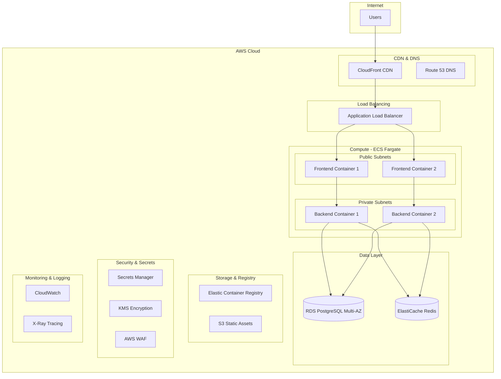

# AWS Production Deployment Design Document

## Overview

This design outlines the comprehensive production deployment architecture for CloudWeave, a full-stack cloud platform management application. The solution implements a modern, scalable, and secure AWS infrastructure using containerized microservices, Infrastructure as Code (IaC), and DevOps best practices.

The architecture follows AWS Well-Architected Framework principles, emphasizing security, reliability, performance efficiency, cost optimization, and operational excellence. The deployment strategy supports both staging and production environments with automated CI/CD pipelines.

## Architecture

### High-Level Architecture



### Network Architecture

**VPC Design:**
- Multi-AZ deployment across 3 availability zones
- Public subnets (10.0.1.0/24, 10.0.2.0/24, 10.0.3.0/24) for load balancers and NAT gateways
- Private subnets (10.0.11.0/24, 10.0.12.0/24, 10.0.13.0/24) for application containers
- Database subnets (10.0.21.0/24, 10.0.22.0/24, 10.0.23.0/24) for RDS instances

**Security Groups:**
- ALB Security Group: Allow HTTP/HTTPS from internet
- Frontend Security Group: Allow traffic from ALB only
- Backend Security Group: Allow traffic from frontend containers only
- Database Security Group: Allow PostgreSQL from backend containers only

## Components and Interfaces

### Container Architecture

**Frontend Container (React/Nginx):**
```dockerfile
# Multi-stage build optimized for production
FROM node:18-alpine AS builder
WORKDIR /app
COPY package*.json ./
RUN npm ci --only=production
COPY . .
RUN npm run build

FROM nginx:alpine
COPY --from=builder /app/dist /usr/share/nginx/html
COPY nginx.conf /etc/nginx/nginx.conf
EXPOSE 80
```

**Backend Container (Go):**
```dockerfile
# Multi-stage build for minimal production image
FROM golang:1.21-alpine AS builder
WORKDIR /app
COPY go.mod go.sum ./
RUN go mod download
COPY . .
RUN CGO_ENABLED=0 GOOS=linux go build -o main cmd/main.go

FROM alpine:latest
RUN apk --no-cache add ca-certificates
WORKDIR /root/
COPY --from=builder /app/main .
EXPOSE 3001
CMD ["./main"]
```

### ECS Service Configuration

**Frontend Service:**
- Task Definition: 2 vCPU, 4GB memory
- Desired Count: 2 (minimum), Auto-scaling up to 10
- Health Check: HTTP GET /health on port 80
- Load Balancer Target Group: HTTP 80

**Backend Service:**
- Task Definition: 1 vCPU, 2GB memory  
- Desired Count: 2 (minimum), Auto-scaling up to 20
- Health Check: HTTP GET /api/v1/health on port 3001
- Load Balancer Target Group: HTTP 3001

### Database Layer

**RDS PostgreSQL Configuration:**
- Engine: PostgreSQL 15.x
- Instance Class: db.t3.medium (production), db.t3.micro (staging)
- Multi-AZ: Enabled for production
- Automated Backups: 7-day retention
- Encryption: Enabled with KMS
- Parameter Group: Custom with optimized settings

**ElastiCache Redis Configuration:**
- Engine: Redis 7.x
- Node Type: cache.t3.micro
- Replication Group: 1 primary, 1 replica
- Encryption: In-transit and at-rest
- Use Case: Session storage, API response caching

### CI/CD Pipeline Architecture

**GitHub Actions Workflow:**
```yaml
# Triggered on push to main/develop branches
stages:
  - test: Run unit tests, integration tests, security scans
  - build: Build Docker images with semantic versioning
  - push: Push images to ECR with proper tagging
  - deploy-staging: Deploy to staging environment
  - integration-tests: Run end-to-end tests against staging
  - deploy-production: Manual approval + production deployment
```

**Deployment Strategy:**
- Blue/Green deployment for zero-downtime updates
- Automated rollback on health check failures
- Feature flags for gradual feature rollouts

## Data Models

### Environment Configuration Schema

```typescript
interface EnvironmentConfig {
  environment: 'staging' | 'production';
  region: string;
  vpc: {
    cidr: string;
    availabilityZones: string[];
  };
  database: {
    instanceClass: string;
    multiAZ: boolean;
    backupRetention: number;
  };
  compute: {
    frontend: {
      cpu: number;
      memory: number;
      desiredCount: number;
      maxCount: number;
    };
    backend: {
      cpu: number;
      memory: number;
      desiredCount: number;
      maxCount: number;
    };
  };
}
```

### Secrets Management Schema

```json
{
  "database": {
    "host": "rds-endpoint",
    "username": "cloudweave_user",
    "password": "generated-secure-password",
    "database": "cloudweave_prod"
  },
  "jwt": {
    "secret": "generated-256-bit-key",
    "expiresIn": "15m",
    "refreshExpiresIn": "7d"
  },
  "redis": {
    "endpoint": "elasticache-endpoint",
    "port": 6379
  }
}
```

### Infrastructure State Management

**Terraform State:**
- Remote state stored in S3 with versioning
- State locking with DynamoDB
- Separate state files for staging/production
- Encrypted state files with KMS

## Error Handling

### Application-Level Error Handling

**Backend Error Response Format:**
```json
{
  "error": {
    "code": "VALIDATION_ERROR",
    "message": "Invalid input parameters",
    "details": {
      "field": "email",
      "reason": "Invalid email format"
    },
    "requestId": "uuid-v4",
    "timestamp": "2025-01-01T00:00:00Z"
  }
}
```

**Frontend Error Boundaries:**
- Global error boundary for unhandled React errors
- API error interceptors with retry logic
- User-friendly error messages with fallback UI
- Error reporting to CloudWatch Logs

### Infrastructure Error Handling

**Auto-Scaling Policies:**
- Scale up: CPU > 70% for 2 consecutive periods
- Scale down: CPU < 30% for 5 consecutive periods
- Target tracking scaling for optimal performance

**Health Check Configuration:**
- ECS Health Checks: HTTP 200 response required
- ALB Health Checks: 3 consecutive successes to mark healthy
- Unhealthy threshold: 2 consecutive failures
- Health check interval: 30 seconds

**Circuit Breaker Pattern:**
- Database connection failures trigger circuit breaker
- Redis cache failures fall back to database queries
- External API failures use cached responses when available

## Testing Strategy

### Testing Pyramid Implementation

**Unit Tests (70%):**
- Go backend: `go test` with coverage > 80%
- React frontend: Vitest with React Testing Library
- Automated in CI pipeline before build stage

**Integration Tests (20%):**
- API endpoint testing with test database
- Database migration testing
- Container integration testing with Docker Compose

**End-to-End Tests (10%):**
- Playwright tests against staging environment
- Critical user journey validation
- Performance testing with load simulation

### Testing Environments

**Local Development:**
- Docker Compose with local PostgreSQL and Redis
- Hot reloading for both frontend and backend
- Mock external services for isolated testing

**Staging Environment:**
- Production-like infrastructure at smaller scale
- Real AWS services for integration testing
- Automated deployment from develop branch

**Production Environment:**
- Blue/green deployment with health checks
- Canary releases for high-risk changes
- Real-time monitoring and alerting

### Security Testing

**Static Analysis:**
- Go: `gosec` for security vulnerabilities
- Frontend: ESLint security rules and dependency scanning
- Infrastructure: `tfsec` for Terraform security issues

**Dynamic Testing:**
- OWASP ZAP integration in CI pipeline
- Penetration testing on staging environment
- Dependency vulnerability scanning with Snyk

### Performance Testing

**Load Testing:**
- Artillery.js for API load testing
- Lighthouse CI for frontend performance
- Database query performance monitoring

**Monitoring and Alerting:**
- CloudWatch custom metrics for business KPIs
- X-Ray distributed tracing for request flow analysis
- PagerDuty integration for critical alerts

### Disaster Recovery Testing

**Backup Validation:**
- Automated backup restoration testing
- Cross-region backup replication verification
- Recovery time objective (RTO): 4 hours
- Recovery point objective (RPO): 1 hour

**Failover Testing:**
- Multi-AZ database failover simulation
- Application auto-scaling under load
- CDN failover and cache invalidation testing