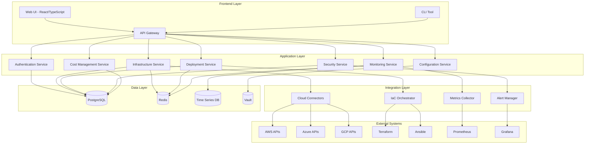

# Design Document

## Overview

The Cloud Platform Engineering App is designed as a modern, cloud-native application that provides a unified interface for managing multi-cloud infrastructure, deployments, and operations. The system follows a microservices architecture with API-first design principles, enabling scalability, maintainability, and integration with existing tools.

The application serves as a control plane that orchestrates various cloud operations while maintaining security, compliance, and cost optimization as core concerns throughout all operations.

## Architecture

### High-Level Architecture



### Technology Stack

- **Frontend**: React with TypeScript, Material-UI for consistent design
- **Backend**: Node.js with Express.js, TypeScript for type safety
- **API Gateway**: Kong or AWS API Gateway for request routing and rate limiting
- **Database**: PostgreSQL for relational data, Redis for caching
- **Time Series**: InfluxDB or Prometheus for metrics storage
- **Message Queue**: Apache Kafka for event streaming
- **Secrets Management**: HashiCorp Vault for secure credential storage
- **Container Platform**: Docker with Kubernetes for orchestration
- **Infrastructure as Code**: Terraform for cloud resource management

## Components and Interfaces

### Core Services

#### Authentication Service
- **Purpose**: Centralized authentication and authorization
- **Key Features**:
  - OAuth 2.0/OIDC integration with enterprise identity providers
  - Role-based access control (RBAC) with fine-grained permissions
  - API key management for service-to-service communication
  - Multi-factor authentication support

#### Infrastructure Service
- **Purpose**: Cloud resource management and orchestration
- **Key Features**:
  - Multi-cloud resource discovery and inventory
  - Infrastructure state management and drift detection
  - Policy enforcement for resource provisioning
  - Cost tracking and resource tagging

#### Deployment Service
- **Purpose**: Application deployment automation
- **Key Features**:
  - GitOps-based deployment workflows
  - Blue-green and canary deployment strategies
  - Rollback capabilities with state preservation
  - Integration with CI/CD pipelines

#### Monitoring Service
- **Purpose**: Observability and alerting
- **Key Features**:
  - Unified metrics collection from multiple sources
  - Custom dashboard creation and management
  - Intelligent alerting with correlation analysis
  - SLA/SLO tracking and reporting

#### Security Service
- **Purpose**: Security policy enforcement and compliance
- **Key Features**:
  - Automated security scanning and vulnerability assessment
  - Compliance framework mapping (SOC2, PCI-DSS, GDPR)
  - Security incident response automation
  - Audit trail generation and retention

#### Cost Management Service
- **Purpose**: Cloud cost optimization and budgeting
- **Key Features**:
  - Real-time cost tracking and allocation
  - Budget alerts and spending forecasts
  - Resource optimization recommendations
  - Chargeback and showback reporting

#### Configuration Service
- **Purpose**: Application configuration and secrets management
- **Key Features**:
  - Environment-specific configuration management
  - Encrypted secrets storage with rotation
  - Configuration versioning and rollback
  - Dynamic configuration updates

### API Design

All services expose RESTful APIs following OpenAPI 3.0 specification:

```yaml
# Example API structure
/api/v1/
  /auth/
    /login
    /logout
    /tokens
  /infrastructure/
    /resources
    /policies
    /compliance
  /deployments/
    /applications
    /environments
    /pipelines
  /monitoring/
    /metrics
    /dashboards
    /alerts
  /security/
    /scans
    /policies
    /incidents
  /cost/
    /reports
    /budgets
    /recommendations
  /config/
    /environments
    /secrets
    /templates
```

## Data Models

### Core Entities

#### Organization
```typescript
interface Organization {
  id: string;
  name: string;
  settings: OrganizationSettings;
  createdAt: Date;
  updatedAt: Date;
}
```

#### Project
```typescript
interface Project {
  id: string;
  organizationId: string;
  name: string;
  description: string;
  environments: Environment[];
  costCenter: string;
  tags: Record<string, string>;
  createdAt: Date;
  updatedAt: Date;
}
```

#### Environment
```typescript
interface Environment {
  id: string;
  projectId: string;
  name: string;
  type: 'development' | 'staging' | 'production';
  cloudProvider: 'aws' | 'azure' | 'gcp';
  region: string;
  resources: Resource[];
  configurations: Configuration[];
  createdAt: Date;
  updatedAt: Date;
}
```

#### Resource
```typescript
interface Resource {
  id: string;
  environmentId: string;
  type: string;
  name: string;
  cloudResourceId: string;
  status: 'active' | 'inactive' | 'error';
  configuration: Record<string, any>;
  cost: CostData;
  tags: Record<string, string>;
  createdAt: Date;
  updatedAt: Date;
}
```

#### Deployment
```typescript
interface Deployment {
  id: string;
  applicationId: string;
  environmentId: string;
  version: string;
  status: 'pending' | 'running' | 'success' | 'failed' | 'rolled_back';
  strategy: 'blue_green' | 'canary' | 'rolling';
  configuration: DeploymentConfig;
  logs: DeploymentLog[];
  createdAt: Date;
  updatedAt: Date;
}
```

## Error Handling

### Error Response Format
```typescript
interface ErrorResponse {
  error: {
    code: string;
    message: string;
    details?: Record<string, any>;
    timestamp: string;
    requestId: string;
  };
}
```

### Error Categories
- **Authentication Errors** (401): Invalid credentials, expired tokens
- **Authorization Errors** (403): Insufficient permissions
- **Validation Errors** (400): Invalid input data, missing required fields
- **Resource Errors** (404): Resource not found
- **Conflict Errors** (409): Resource already exists, state conflicts
- **Rate Limiting** (429): Too many requests
- **Server Errors** (500): Internal system errors
- **Service Unavailable** (503): External service dependencies unavailable

### Error Handling Strategy
- Implement circuit breaker pattern for external service calls
- Use exponential backoff for retryable operations
- Provide detailed error messages for debugging while sanitizing sensitive information
- Log all errors with correlation IDs for traceability
- Implement graceful degradation for non-critical features

## Testing Strategy

### Unit Testing
- **Coverage Target**: 90% code coverage for all services
- **Framework**: Jest for Node.js services, React Testing Library for frontend
- **Focus Areas**: Business logic, data validation, error handling

### Integration Testing
- **API Testing**: Automated testing of all REST endpoints
- **Database Testing**: Test data persistence and retrieval operations
- **External Service Mocking**: Mock cloud provider APIs for consistent testing

### End-to-End Testing
- **User Journey Testing**: Critical user workflows from UI to backend
- **Cross-Service Testing**: Test interactions between microservices
- **Performance Testing**: Load testing for scalability validation

### Security Testing
- **Vulnerability Scanning**: Automated security scanning in CI/CD pipeline
- **Penetration Testing**: Regular security assessments
- **Compliance Testing**: Automated compliance rule validation

### Infrastructure Testing
- **Infrastructure as Code Testing**: Validate Terraform configurations
- **Container Security**: Scan container images for vulnerabilities
- **Deployment Testing**: Validate deployment processes in staging environments