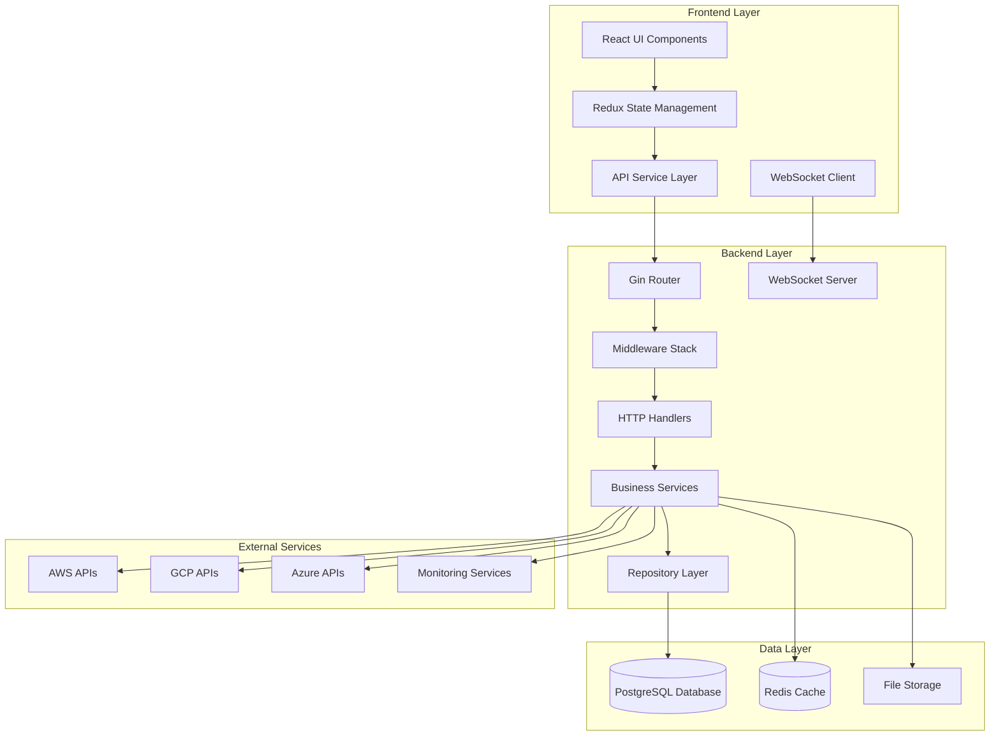

# Core Functionality Completion Design Document

## Overview

This design document outlines the comprehensive implementation plan for completing the CloudWeave cloud platform management system. The application currently has a solid foundation with JWT authentication, glassmorphism UI components, and a well-structured React frontend with Go backend. This design builds upon the existing architecture to create a fully functional cloud management platform with database integration, real authentication, comprehensive API endpoints, and complete UI functionality.

The design follows the existing architectural patterns while adding production-ready features including PostgreSQL database integration, secure authentication, real-time monitoring, and comprehensive cloud resource management capabilities.

## Architecture

### Current Architecture Analysis

**Existing Strengths:**
- Well-structured Go backend with Gin framework
- Modern React frontend with TypeScript and Redux Toolkit
- JWT authentication foundation with proper token management
- Glassmorphism UI components with consistent design system
- Proper middleware structure with request ID, logging, and error handling
- Comprehensive API service with interceptors and error handling

**Architecture Enhancements:**



### Database Architecture

**PostgreSQL Schema Design:**

```sql
-- Users and Authentication
CREATE TABLE users (
    id UUID PRIMARY KEY DEFAULT gen_random_uuid(),
    email VARCHAR(255) UNIQUE NOT NULL,
    name VARCHAR(255) NOT NULL,
    password_hash VARCHAR(255) NOT NULL,
    role VARCHAR(50) NOT NULL DEFAULT 'user',
    organization_id UUID,
    preferences JSONB DEFAULT '{}',
    avatar_url VARCHAR(500),
    email_verified BOOLEAN DEFAULT false,
    created_at TIMESTAMP WITH TIME ZONE DEFAULT NOW(),
    updated_at TIMESTAMP WITH TIME ZONE DEFAULT NOW(),
    last_login_at TIMESTAMP WITH TIME ZONE
);

-- Organizations
CREATE TABLE organizations (
    id UUID PRIMARY KEY DEFAULT gen_random_uuid(),
    name VARCHAR(255) NOT NULL,
    slug VARCHAR(100) UNIQUE NOT NULL,
    settings JSONB DEFAULT '{}',
    created_at TIMESTAMP WITH TIME ZONE DEFAULT NOW(),
    updated_at TIMESTAMP WITH TIME ZONE DEFAULT NOW()
);

-- Infrastructure Resources
CREATE TABLE infrastructure (
    id UUID PRIMARY KEY DEFAULT gen_random_uuid(),
    organization_id UUID NOT NULL REFERENCES organizations(id),
    name VARCHAR(255) NOT NULL,
    type VARCHAR(50) NOT NULL,
    provider VARCHAR(50) NOT NULL,
    region VARCHAR(100) NOT NULL,
    status VARCHAR(50) NOT NULL DEFAULT 'pending',
    specifications JSONB DEFAULT '{}',
    cost_info JSONB DEFAULT '{}',
    tags JSONB DEFAULT '[]',
    external_id VARCHAR(255),
    created_at TIMESTAMP WITH TIME ZONE DEFAULT NOW(),
    updated_at TIMESTAMP WITH TIME ZONE DEFAULT NOW()
);

-- Deployments
CREATE TABLE deployments (
    id UUID PRIMARY KEY DEFAULT gen_random_uuid(),
    organization_id UUID NOT NULL REFERENCES organizations(id),
    name VARCHAR(255) NOT NULL,
    application VARCHAR(255) NOT NULL,
    version VARCHAR(100) NOT NULL,
    environment VARCHAR(50) NOT NULL,
    status VARCHAR(50) NOT NULL DEFAULT 'pending',
    progress INTEGER DEFAULT 0,
    configuration JSONB DEFAULT '{}',
    started_at TIMESTAMP WITH TIME ZONE,
    completed_at TIMESTAMP WITH TIME ZONE,
    created_by UUID REFERENCES users(id),
    created_at TIMESTAMP WITH TIME ZONE DEFAULT NOW(),
    updated_at TIMESTAMP WITH TIME ZONE DEFAULT NOW()
);

-- Monitoring Metrics
CREATE TABLE metrics (
    id UUID PRIMARY KEY DEFAULT gen_random_uuid(),
    resource_id UUID,
    resource_type VARCHAR(50) NOT NULL,
    metric_name VARCHAR(100) NOT NULL,
    value DECIMAL(15,4) NOT NULL,
    unit VARCHAR(20),
    tags JSONB DEFAULT '{}',
    timestamp TIMESTAMP WITH TIME ZONE NOT NULL,
    created_at TIMESTAMP WITH TIME ZONE DEFAULT NOW()
);

-- Audit Logs
CREATE TABLE audit_logs (
    id UUID PRIMARY KEY DEFAULT gen_random_uuid(),
    organization_id UUID NOT NULL REFERENCES organizations(id),
    user_id UUID REFERENCES users(id),
    action VARCHAR(100) NOT NULL,
    resource_type VARCHAR(50),
    resource_id UUID,
    details JSONB DEFAULT '{}',
    ip_address INET,
    user_agent TEXT,
    created_at TIMESTAMP WITH TIME ZONE DEFAULT NOW()
);
```

## Components and Interfaces

### Backend Service Architecture

**Database Layer:**
```go
// Repository interfaces for data access
type UserRepository interface {
    Create(ctx context.Context, user *models.User) error
    GetByID(ctx context.Context, id string) (*models.User, error)
    GetByEmail(ctx context.Context, email string) (*models.User, error)
    Update(ctx context.Context, user *models.User) error
    Delete(ctx context.Context, id string) error
}

type InfrastructureRepository interface {
    Create(ctx context.Context, infra *models.Infrastructure) error
    GetByID(ctx context.Context, id string) (*models.Infrastructure, error)
    List(ctx context.Context, orgID string, params ListParams) ([]*models.Infrastructure, error)
    Update(ctx context.Context, infra *models.Infrastructure) error
    Delete(ctx context.Context, id string) error
}

// Database connection and migration management
type Database struct {
    db *sql.DB
    migrator *migrate.Migrate
}

func (d *Database) Connect(dsn string) error
func (d *Database) Migrate() error
func (d *Database) Close() error
```

**Service Layer:**
```go
// Business logic services
type AuthService struct {
    userRepo UserRepository
    jwtService *JWTService
    hasher PasswordHasher
}

func (s *AuthService) Register(ctx context.Context, req RegisterRequest) (*User, error)
func (s *AuthService) Login(ctx context.Context, req LoginRequest) (*LoginResponse, error)
func (s *AuthService) RefreshToken(ctx context.Context, refreshToken string) (*TokenResponse, error)

type InfrastructureService struct {
    infraRepo InfrastructureRepository
    cloudProviders map[string]CloudProvider
    metricsCollector MetricsCollector
}

func (s *InfrastructureService) CreateResource(ctx context.Context, req CreateInfraRequest) (*Infrastructure, error)
func (s *InfrastructureService) GetResources(ctx context.Context, orgID string) ([]*Infrastructure, error)
func (s *InfrastructureService) UpdateResource(ctx context.Context, id string, req UpdateInfraRequest) error
```

**Cloud Provider Integration:**
```go
// Cloud provider abstraction
type CloudProvider interface {
    GetResources(ctx context.Context, config ProviderConfig) ([]*Resource, error)
    CreateResource(ctx context.Context, config ProviderConfig, spec ResourceSpec) (*Resource, error)
    UpdateResource(ctx context.Context, config ProviderConfig, id string, spec ResourceSpec) error
    DeleteResource(ctx context.Context, config ProviderConfig, id string) error
    GetMetrics(ctx context.Context, config ProviderConfig, resourceID string) ([]*Metric, error)
}

// AWS implementation
type AWSProvider struct {
    ec2Client *ec2.Client
    rdsClient *rds.Client
    s3Client *s3.Client
}

// GCP implementation  
type GCPProvider struct {
    computeService *compute.Service
    storageClient *storage.Client
}
```

### Frontend Architecture Enhancements

**State Management:**
```typescript
// Enhanced Redux store structure
interface RootState {
  auth: AuthState;
  ui: UIState;
  infrastructure: InfrastructureState;
  deployments: DeploymentState;
  monitoring: MonitoringState;
  security: SecurityState;
  costManagement: CostManagementState;
  settings: SettingsState;
}

// Infrastructure state management
interface InfrastructureState {
  resources: Infrastructure[];
  loading: boolean;
  error: string | null;
  filters: InfrastructureFilters;
  selectedResource: Infrastructure | null;
  metrics: Record<string, MetricData[]>;
}

// Real-time updates with WebSocket
const useWebSocket = (url: string) => {
  const dispatch = useAppDispatch();
  
  useEffect(() => {
    const ws = new WebSocket(url);
    
    ws.onmessage = (event) => {
      const message = JSON.parse(event.data);
      dispatch(handleWebSocketMessage(message));
    };
    
    return () => ws.close();
  }, [url, dispatch]);
};
```

**Component Architecture:**
```typescript
// Enhanced page components with real functionality
const InfrastructurePage: React.FC = () => {
  const dispatch = useAppDispatch();
  const { resources, loading, error } = useAppSelector(state => state.infrastructure);
  
  useEffect(() => {
    dispatch(fetchInfrastructure());
  }, [dispatch]);
  
  const handleCreateResource = async (data: CreateInfrastructureRequest) => {
    await dispatch(createInfrastructure(data));
  };
  
  return (
    <InfrastructureLayout>
      <ResourceList 
        resources={resources}
        loading={loading}
        onCreateResource={handleCreateResource}
      />
    </InfrastructureLayout>
  );
};

// Real-time monitoring components
const MonitoringDashboard: React.FC = () => {
  const [metrics, setMetrics] = useState<MetricData[]>([]);
  
  useWebSocket('ws://localhost:3001/ws/metrics', {
    onMessage: (data) => {
      setMetrics(prev => [...prev, data]);
    }
  });
  
  return (
    <Grid container spacing={3}>
      <Grid item xs={12} md={6}>
        <MetricChart data={metrics} type="cpu" />
      </Grid>
      <Grid item xs={12} md={6}>
        <MetricChart data={metrics} type="memory" />
      </Grid>
    </Grid>
  );
};
```

## Data Models

### Enhanced Data Models

**User and Authentication Models:**
```go
type User struct {
    ID             string                 `json:"id" db:"id"`
    Email          string                 `json:"email" db:"email"`
    Name           string                 `json:"name" db:"name"`
    PasswordHash   string                 `json:"-" db:"password_hash"`
    Role           string                 `json:"role" db:"role"`
    OrganizationID string                 `json:"organizationId" db:"organization_id"`
    Preferences    map[string]interface{} `json:"preferences" db:"preferences"`
    AvatarURL      *string                `json:"avatarUrl" db:"avatar_url"`
    EmailVerified  bool                   `json:"emailVerified" db:"email_verified"`
    CreatedAt      time.Time              `json:"createdAt" db:"created_at"`
    UpdatedAt      time.Time              `json:"updatedAt" db:"updated_at"`
    LastLoginAt    *time.Time             `json:"lastLoginAt" db:"last_login_at"`
}

type Organization struct {
    ID        string                 `json:"id" db:"id"`
    Name      string                 `json:"name" db:"name"`
    Slug      string                 `json:"slug" db:"slug"`
    Settings  map[string]interface{} `json:"settings" db:"settings"`
    CreatedAt time.Time              `json:"createdAt" db:"created_at"`
    UpdatedAt time.Time              `json:"updatedAt" db:"updated_at"`
}
```

**Infrastructure Models:**
```go
type Infrastructure struct {
    ID             string                 `json:"id" db:"id"`
    OrganizationID string                 `json:"organizationId" db:"organization_id"`
    Name           string                 `json:"name" db:"name"`
    Type           string                 `json:"type" db:"type"`
    Provider       string                 `json:"provider" db:"provider"`
    Region         string                 `json:"region" db:"region"`
    Status         string                 `json:"status" db:"status"`
    Specifications map[string]interface{} `json:"specifications" db:"specifications"`
    CostInfo       map[string]interface{} `json:"costInfo" db:"cost_info"`
    Tags           []string               `json:"tags" db:"tags"`
    ExternalID     *string                `json:"externalId" db:"external_id"`
    CreatedAt      time.Time              `json:"createdAt" db:"created_at"`
    UpdatedAt      time.Time              `json:"updatedAt" db:"updated_at"`
}

type Deployment struct {
    ID             string                 `json:"id" db:"id"`
    OrganizationID string                 `json:"organizationId" db:"organization_id"`
    Name           string                 `json:"name" db:"name"`
    Application    string                 `json:"application" db:"application"`
    Version        string                 `json:"version" db:"version"`
    Environment    string                 `json:"environment" db:"environment"`
    Status         string                 `json:"status" db:"status"`
    Progress       int                    `json:"progress" db:"progress"`
    Configuration  map[string]interface{} `json:"configuration" db:"configuration"`
    StartedAt      *time.Time             `json:"startedAt" db:"started_at"`
    CompletedAt    *time.Time             `json:"completedAt" db:"completed_at"`
    CreatedBy      string                 `json:"createdBy" db:"created_by"`
    CreatedAt      time.Time              `json:"createdAt" db:"created_at"`
    UpdatedAt      time.Time              `json:"updatedAt" db:"updated_at"`
}
```

**Monitoring Models:**
```go
type Metric struct {
    ID           string                 `json:"id" db:"id"`
    ResourceID   *string                `json:"resourceId" db:"resource_id"`
    ResourceType string                 `json:"resourceType" db:"resource_type"`
    MetricName   string                 `json:"metricName" db:"metric_name"`
    Value        float64                `json:"value" db:"value"`
    Unit         string                 `json:"unit" db:"unit"`
    Tags         map[string]interface{} `json:"tags" db:"tags"`
    Timestamp    time.Time              `json:"timestamp" db:"timestamp"`
    CreatedAt    time.Time              `json:"createdAt" db:"created_at"`
}

type Alert struct {
    ID          string    `json:"id" db:"id"`
    Type        string    `json:"type" db:"type"`
    Severity    string    `json:"severity" db:"severity"`
    Title       string    `json:"title" db:"title"`
    Message     string    `json:"message" db:"message"`
    ResourceID  *string   `json:"resourceId" db:"resource_id"`
    Acknowledged bool     `json:"acknowledged" db:"acknowledged"`
    CreatedAt   time.Time `json:"createdAt" db:"created_at"`
    UpdatedAt   time.Time `json:"updatedAt" db:"updated_at"`
}
```

## Error Handling

### Comprehensive Error Management

**Backend Error Handling:**
```go
// Custom error types
type AppError struct {
    Code       string                 `json:"code"`
    Message    string                 `json:"message"`
    Details    map[string]interface{} `json:"details,omitempty"`
    StatusCode int                    `json:"-"`
    Timestamp  time.Time              `json:"timestamp"`
}

func (e *AppError) Error() string {
    return e.Message
}

// Error handling middleware
func ErrorHandlerMiddleware() gin.HandlerFunc {
    return func(c *gin.Context) {
        c.Next()
        
        if len(c.Errors) > 0 {
            err := c.Errors.Last()
            
            var appErr *AppError
            if errors.As(err.Err, &appErr) {
                c.JSON(appErr.StatusCode, models.ApiResponse{
                    Success:   false,
                    Error:     appErr,
                    RequestID: c.GetString("requestID"),
                })
                return
            }
            
            // Handle unknown errors
            c.JSON(http.StatusInternalServerError, models.ApiResponse{
                Success: false,
                Error: &AppError{
                    Code:      "INTERNAL_ERROR",
                    Message:   "An internal error occurred",
                    Timestamp: time.Now(),
                },
                RequestID: c.GetString("requestID"),
            })
        }
    }
}

// Service-level error handling
func (s *InfrastructureService) CreateResource(ctx context.Context, req CreateInfraRequest) (*Infrastructure, error) {
    if err := validateCreateRequest(req); err != nil {
        return nil, &AppError{
            Code:       "VALIDATION_ERROR",
            Message:    "Invalid request parameters",
            Details:    map[string]interface{}{"validation": err.Error()},
            StatusCode: http.StatusBadRequest,
            Timestamp:  time.Now(),
        }
    }
    
    resource, err := s.infraRepo.Create(ctx, &Infrastructure{
        Name:     req.Name,
        Type:     req.Type,
        Provider: req.Provider,
        // ... other fields
    })
    
    if err != nil {
        return nil, &AppError{
            Code:       "DATABASE_ERROR",
            Message:    "Failed to create resource",
            StatusCode: http.StatusInternalServerError,
            Timestamp:  time.Now(),
        }
    }
    
    return resource, nil
}
```

**Frontend Error Handling:**
```typescript
// Enhanced error handling in Redux
const infrastructureSlice = createSlice({
  name: 'infrastructure',
  initialState,
  reducers: {
    setError: (state, action) => {
      state.error = action.payload;
      state.loading = false;
    },
    clearError: (state) => {
      state.error = null;
    },
  },
  extraReducers: (builder) => {
    builder
      .addCase(createInfrastructure.rejected, (state, action) => {
        state.loading = false;
        state.error = action.payload || 'Failed to create infrastructure';
        
        // Show user-friendly error notification
        toast.error(getUserFriendlyError(action.payload));
      });
  },
});

// Error boundary component
class ErrorBoundary extends React.Component<Props, State> {
  constructor(props: Props) {
    super(props);
    this.state = { hasError: false, error: null };
  }
  
  static getDerivedStateFromError(error: Error): State {
    return { hasError: true, error };
  }
  
  componentDidCatch(error: Error, errorInfo: ErrorInfo) {
    console.error('Error caught by boundary:', error, errorInfo);
    // Send to error reporting service
    errorReportingService.captureException(error, errorInfo);
  }
  
  render() {
    if (this.state.hasError) {
      return <ErrorFallback error={this.state.error} />;
    }
    
    return this.props.children;
  }
}
```

## Testing Strategy

### Comprehensive Testing Implementation

**Backend Testing:**
```go
// Unit tests for services
func TestInfrastructureService_CreateResource(t *testing.T) {
    tests := []struct {
        name    string
        request CreateInfraRequest
        mockFn  func(*mocks.InfrastructureRepository)
        want    *Infrastructure
        wantErr bool
    }{
        {
            name: "successful creation",
            request: CreateInfraRequest{
                Name:     "test-server",
                Type:     "server",
                Provider: "aws",
                Region:   "us-west-2",
            },
            mockFn: func(repo *mocks.InfrastructureRepository) {
                repo.On("Create", mock.Anything, mock.AnythingOfType("*models.Infrastructure")).
                    Return(nil)
            },
            want: &Infrastructure{
                Name:     "test-server",
                Type:     "server",
                Provider: "aws",
                Region:   "us-west-2",
            },
            wantErr: false,
        },
        {
            name: "validation error",
            request: CreateInfraRequest{
                Name: "", // Invalid empty name
            },
            mockFn:  func(repo *mocks.InfrastructureRepository) {},
            want:    nil,
            wantErr: true,
        },
    }
    
    for _, tt := range tests {
        t.Run(tt.name, func(t *testing.T) {
            mockRepo := new(mocks.InfrastructureRepository)
            tt.mockFn(mockRepo)
            
            service := NewInfrastructureService(mockRepo)
            got, err := service.CreateResource(context.Background(), tt.request)
            
            if tt.wantErr {
                assert.Error(t, err)
                return
            }
            
            assert.NoError(t, err)
            assert.Equal(t, tt.want.Name, got.Name)
            mockRepo.AssertExpectations(t)
        })
    }
}

// Integration tests
func TestInfrastructureAPI_Integration(t *testing.T) {
    // Setup test database
    db := setupTestDB(t)
    defer db.Close()
    
    // Setup test server
    router := setupTestRouter(db)
    server := httptest.NewServer(router)
    defer server.Close()
    
    // Test create infrastructure
    payload := `{
        "name": "test-server",
        "type": "server",
        "provider": "aws",
        "region": "us-west-2"
    }`
    
    resp, err := http.Post(server.URL+"/api/v1/infrastructure", "application/json", strings.NewReader(payload))
    assert.NoError(t, err)
    assert.Equal(t, http.StatusCreated, resp.StatusCode)
    
    // Verify response
    var response models.ApiResponse
    err = json.NewDecoder(resp.Body).Decode(&response)
    assert.NoError(t, err)
    assert.True(t, response.Success)
}
```

**Frontend Testing:**
```typescript
// Component testing with React Testing Library
describe('InfrastructurePage', () => {
  const mockStore = configureStore({
    reducer: {
      infrastructure: infrastructureReducer,
      auth: authReducer,
      ui: uiReducer,
    },
    preloadedState: {
      infrastructure: {
        resources: mockInfrastructureData,
        loading: false,
        error: null,
      },
      auth: {
        isAuthenticated: true,
        user: mockUser,
      },
    },
  });

  it('renders infrastructure list correctly', async () => {
    render(
      <Provider store={mockStore}>
        <MemoryRouter>
          <InfrastructurePage />
        </MemoryRouter>
      </Provider>
    );

    expect(screen.getByText('Infrastructure Management')).toBeInTheDocument();
    expect(screen.getByText('test-server-1')).toBeInTheDocument();
    expect(screen.getByText('test-server-2')).toBeInTheDocument();
  });

  it('handles create resource action', async () => {
    const user = userEvent.setup();
    
    render(
      <Provider store={mockStore}>
        <MemoryRouter>
          <InfrastructurePage />
        </MemoryRouter>
      </Provider>
    );

    const createButton = screen.getByRole('button', { name: /create resource/i });
    await user.click(createButton);

    expect(screen.getByText('Create New Resource')).toBeInTheDocument();
  });
});

// API service testing
describe('InfrastructureService', () => {
  beforeEach(() => {
    jest.clearAllMocks();
    (axios.post as jest.Mock).mockClear();
  });

  it('creates infrastructure resource successfully', async () => {
    const mockResponse = {
      data: {
        success: true,
        data: mockInfrastructure,
      },
    };
    
    (axios.post as jest.Mock).mockResolvedValue(mockResponse);

    const result = await InfrastructureService.createResource(mockCreateRequest);

    expect(axios.post).toHaveBeenCalledWith('/infrastructure', mockCreateRequest);
    expect(result).toEqual(mockInfrastructure);
  });

  it('handles API errors correctly', async () => {
    const mockError = {
      response: {
        status: 400,
        data: {
          success: false,
          error: {
            code: 'VALIDATION_ERROR',
            message: 'Invalid request parameters',
          },
        },
      },
    };

    (axios.post as jest.Mock).mockRejectedValue(mockError);

    await expect(InfrastructureService.createResource(mockCreateRequest))
      .rejects.toThrow('Invalid request parameters');
  });
});

// End-to-end testing with Playwright
test('complete infrastructure management flow', async ({ page }) => {
  // Login
  await page.goto('/login');
  await page.fill('[data-testid="email"]', 'demo@cloudweave.com');
  await page.fill('[data-testid="password"]', 'password123');
  await page.click('[data-testid="login-button"]');

  // Navigate to infrastructure
  await page.click('[data-testid="infrastructure-nav"]');
  await expect(page).toHaveURL('/infrastructure');

  // Create new resource
  await page.click('[data-testid="create-resource-button"]');
  await page.fill('[data-testid="resource-name"]', 'test-server');
  await page.selectOption('[data-testid="resource-type"]', 'server');
  await page.selectOption('[data-testid="resource-provider"]', 'aws');
  await page.click('[data-testid="create-button"]');

  // Verify creation
  await expect(page.locator('[data-testid="resource-list"]')).toContainText('test-server');
});
```