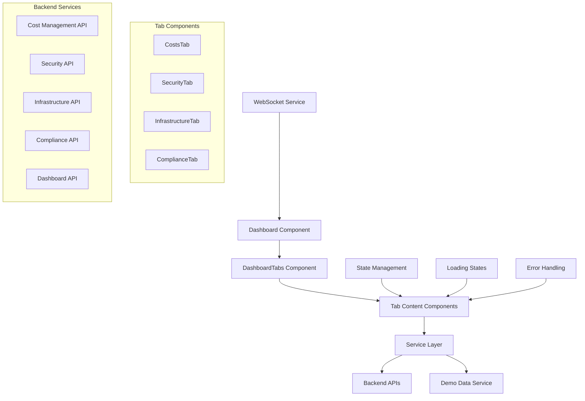

# Dashboard Completion Design Document

## Overview

The dashboard completion feature transforms the existing dashboard tabs from template-based displays to fully functional components that integrate with real backend services. The design focuses on connecting existing backend APIs to the frontend dashboard tabs while maintaining consistent user experience, proper error handling, and responsive design patterns.

The current dashboard already has a solid foundation with tab navigation, real-time WebSocket integration, and glassmorphism UI components. This design builds upon these existing patterns to create a cohesive, data-driven dashboard experience.

## Architecture

### High-Level Architecture



### Data Flow Architecture

The dashboard follows a unidirectional data flow pattern:

1. **Tab Selection**: User selects a tab, triggering component mount/update
2. **Data Fetching**: Component calls appropriate service methods
3. **Loading States**: UI shows skeleton/loading components during fetch
4. **Data Processing**: Services transform API responses for UI consumption
5. **Rendering**: Components render data with charts, tables, and metrics
6. **Real-time Updates**: WebSocket updates refresh data automatically
7. **Error Handling**: Failed requests show user-friendly error messages with retry options

## Components and Interfaces

### Core Components

#### 1. Enhanced Tab Components

Each tab component follows a consistent pattern:

```typescript
interface TabComponentProps {
  isDark: boolean;
}

interface TabState<T> {
  data: T | null;
  loading: boolean;
  error: string | null;
  lastUpdated: Date;
}
```

**CostsTab Component**
- Integrates with `costService` for real cost data
- Displays cost trends, breakdowns, and optimization recommendations
- Shows loading skeletons during data fetch
- Handles demo mode with realistic sample data
- Provides export functionality for cost reports

**SecurityTab Component**
- Connects to security service for vulnerability data
- Shows security score, scan results, and compliance status
- Displays alerts with severity indicators
- Links to detailed security pages for drill-down
- Handles empty states for unconfigured security scans

**InfrastructureTab Component**
- Fetches infrastructure metrics from backend
- Shows resource utilization, performance metrics
- Displays infrastructure topology and health status
- Provides real-time monitoring capabilities
- Handles multi-cloud resource aggregation

**ComplianceTab Component** (New)
- Integrates with compliance service
- Shows framework adherence and violation status
- Displays remediation recommendations
- Tracks compliance score trends
- Provides audit trail functionality

#### 2. Service Layer Enhancements

**Enhanced Dashboard Service**
```typescript
interface DashboardService {
  // Existing methods enhanced
  getDashboardStats(): Promise<DashboardStats>;
  getRecentActivity(): Promise<DashboardActivity[]>;
  
  // New tab-specific methods
  getCostMetrics(): Promise<CostMetrics>;
  getSecurityMetrics(): Promise<SecurityMetrics>;
  getInfrastructureMetrics(): Promise<InfrastructureMetrics>;
  getComplianceMetrics(): Promise<ComplianceMetrics>;
  
  // Real-time subscription management
  subscribeToUpdates(tabId: string, callback: Function): () => void;
  unsubscribeFromUpdates(tabId: string): void;
}
```

**Tab State Management**
```typescript
interface TabStateManager {
  activeTab: string;
  tabData: Record<string, any>;
  loadingStates: Record<string, boolean>;
  errorStates: Record<string, string | null>;
  
  setActiveTab(tabId: string): void;
  updateTabData(tabId: string, data: any): void;
  setLoadingState(tabId: string, loading: boolean): void;
  setErrorState(tabId: string, error: string | null): void;
}
```

#### 3. Data Integration Patterns

**API Integration Strategy**
- Primary: Real backend API calls through existing service layer
- Fallback: Demo data service for development and demo mode
- Caching: Recent data cached to improve performance
- Error Recovery: Graceful degradation with retry mechanisms

**Demo Mode Integration**
- Seamless switching between real and demo data
- Clear visual indicators when in demo mode
- Realistic data patterns that match production scenarios
- Preserved user preferences across mode switches

## Data Models

### Enhanced Data Structures

```typescript
// Cost Tab Data Models
interface CostMetrics extends DashboardCostMetrics {
  trends: CostTrend[];
  breakdown: CostBreakdown;
  recommendations: CostRecommendation[];
  budgetStatus: BudgetStatus;
  realTimeSpend: RealTimeSpend;
}

// Security Tab Data Models
interface SecurityMetrics extends DashboardSecurityMetrics {
  vulnerabilities: VulnerabilityCount;
  scanHistory: SecurityScan[];
  complianceFrameworks: ComplianceFramework[];
  securityAlerts: SecurityAlert[];
  riskAssessment: RiskAssessment;
}

// Infrastructure Tab Data Models
interface InfrastructureMetrics extends DashboardInfrastructureMetrics {
  resourceHealth: ResourceHealth[];
  performanceMetrics: PerformanceMetrics;
  capacityPlanning: CapacityMetrics;
  networkTopology: NetworkTopology;
  alertSummary: InfrastructureAlert[];
}

// Compliance Tab Data Models (New)
interface ComplianceMetrics {
  overallScore: number;
  frameworks: ComplianceFramework[];
  violations: ComplianceViolation[];
  auditTrail: AuditEvent[];
  remediationTasks: RemediationTask[];
  lastAssessment: Date;
}
```

### State Management Models

```typescript
interface DashboardState {
  activeTab: string;
  tabStates: Record<string, TabState>;
  globalLoading: boolean;
  realTimeEnabled: boolean;
  demoMode: boolean;
  lastGlobalUpdate: Date;
}

interface TabState {
  data: any;
  loading: boolean;
  error: string | null;
  lastUpdated: Date;
  subscribed: boolean;
}
```

## Error Handling

### Error Handling Strategy

**Layered Error Handling**
1. **Service Level**: API call failures, network errors, timeout handling
2. **Component Level**: Data transformation errors, rendering failures
3. **UI Level**: User-friendly error messages, retry mechanisms
4. **Global Level**: Fallback to demo data, system-wide error recovery

**Error Types and Responses**

```typescript
interface ErrorHandlingStrategy {
  networkError: {
    message: "Unable to connect to services";
    action: "retry" | "fallback_demo";
    retryDelay: number;
  };
  
  dataError: {
    message: "Data temporarily unavailable";
    action: "show_cached" | "show_empty_state";
    fallbackData?: any;
  };
  
  authError: {
    message: "Authentication required";
    action: "redirect_login";
  };
  
  serviceError: {
    message: "Service temporarily unavailable";
    action: "retry" | "fallback_demo";
    maxRetries: number;
  };
}
```

**User Experience During Errors**
- Non-blocking error messages that don't disrupt workflow
- Automatic retry mechanisms with exponential backoff
- Graceful degradation to cached or demo data
- Clear indication of data freshness and reliability
- Easy access to retry actions and support information

### Error Recovery Mechanisms

**Automatic Recovery**
- Network reconnection detection
- Automatic data refresh after connectivity restoration
- Background retry for failed requests
- Smart caching to minimize data loss

**User-Initiated Recovery**
- Prominent retry buttons on error states
- Manual refresh capabilities
- Option to switch to demo mode temporarily
- Clear feedback on recovery progress

## Testing Strategy

### Component Testing

**Unit Tests**
- Individual tab component rendering with mock data
- Service method functionality and error handling
- State management logic and transitions
- Data transformation and validation

**Integration Tests**
- Tab switching and state persistence
- Real-time update handling
- Demo mode transitions
- Error boundary functionality

**End-to-End Tests**
- Complete dashboard workflow testing
- Cross-tab navigation and data consistency
- Performance under various network conditions
- Accessibility compliance verification

### Testing Scenarios

**Data Loading Scenarios**
- Initial load with empty state
- Successful data fetch and display
- Loading state transitions
- Error state handling and recovery

**Real-time Update Scenarios**
- WebSocket connection establishment
- Live data updates across tabs
- Connection loss and reconnection
- Update frequency and performance impact

**Demo Mode Scenarios**
- Demo data generation and display
- Switching between demo and real data
- Demo indicators and user awareness
- Data consistency in demo mode

### Performance Testing

**Load Testing**
- Dashboard performance with large datasets
- Memory usage during extended sessions
- Network request optimization
- Rendering performance with complex charts

**Responsiveness Testing**
- Mobile and tablet layout adaptation
- Touch interaction optimization
- Performance on low-end devices
- Accessibility with screen readers

## Implementation Approach

### Phase 1: Core Tab Integration
1. **Costs Tab Enhancement**
   - Connect to existing cost management service
   - Implement loading states and error handling
   - Add chart components for cost visualization
   - Integrate demo mode support

2. **Security Tab Implementation**
   - Connect to security service APIs
   - Display vulnerability counts and security score
   - Implement alert severity indicators
   - Add navigation to detailed security views

### Phase 2: Infrastructure and Compliance
1. **Infrastructure Tab Enhancement**
   - Integrate with infrastructure metrics service
   - Display resource health and performance data
   - Implement real-time monitoring capabilities
   - Add capacity planning visualizations

2. **Compliance Tab Creation**
   - Design and implement compliance data models
   - Create compliance service integration
   - Build compliance score and violation displays
   - Implement audit trail functionality

### Phase 3: Advanced Features
1. **Real-time Enhancements**
   - Optimize WebSocket integration for tab-specific updates
   - Implement intelligent update frequency management
   - Add real-time notification system
   - Enhance performance monitoring

2. **User Experience Improvements**
   - Advanced filtering and search capabilities
   - Customizable dashboard layouts
   - Export and reporting functionality
   - Enhanced accessibility features

### Design Decisions and Rationales

**Service Layer Architecture**
- **Decision**: Maintain existing service pattern with enhanced methods
- **Rationale**: Preserves current architecture while adding needed functionality
- **Alternative Considered**: Complete service restructure (rejected due to complexity)

**State Management Approach**
- **Decision**: Component-level state with centralized tab management
- **Rationale**: Balances simplicity with functionality, avoids over-engineering
- **Alternative Considered**: Redux/Zustand integration (deferred for future enhancement)

**Error Handling Strategy**
- **Decision**: Layered error handling with graceful degradation
- **Rationale**: Provides robust user experience while maintaining system stability
- **Alternative Considered**: Simple error boundaries (insufficient for requirements)

**Demo Mode Integration**
- **Decision**: Seamless integration with existing demo data service
- **Rationale**: Leverages existing infrastructure while meeting demo requirements
- **Alternative Considered**: Separate demo components (would duplicate code)

**Real-time Update Management**
- **Decision**: Tab-specific subscription management
- **Rationale**: Optimizes performance by only updating active/visible content
- **Alternative Considered**: Global updates for all tabs (performance concerns)

This design ensures that the dashboard completion feature integrates seamlessly with the existing codebase while providing a robust, scalable foundation for future enhancements. The focus on user experience, error handling, and performance optimization addresses all requirements while maintaining the high-quality standards established in the current implementation.