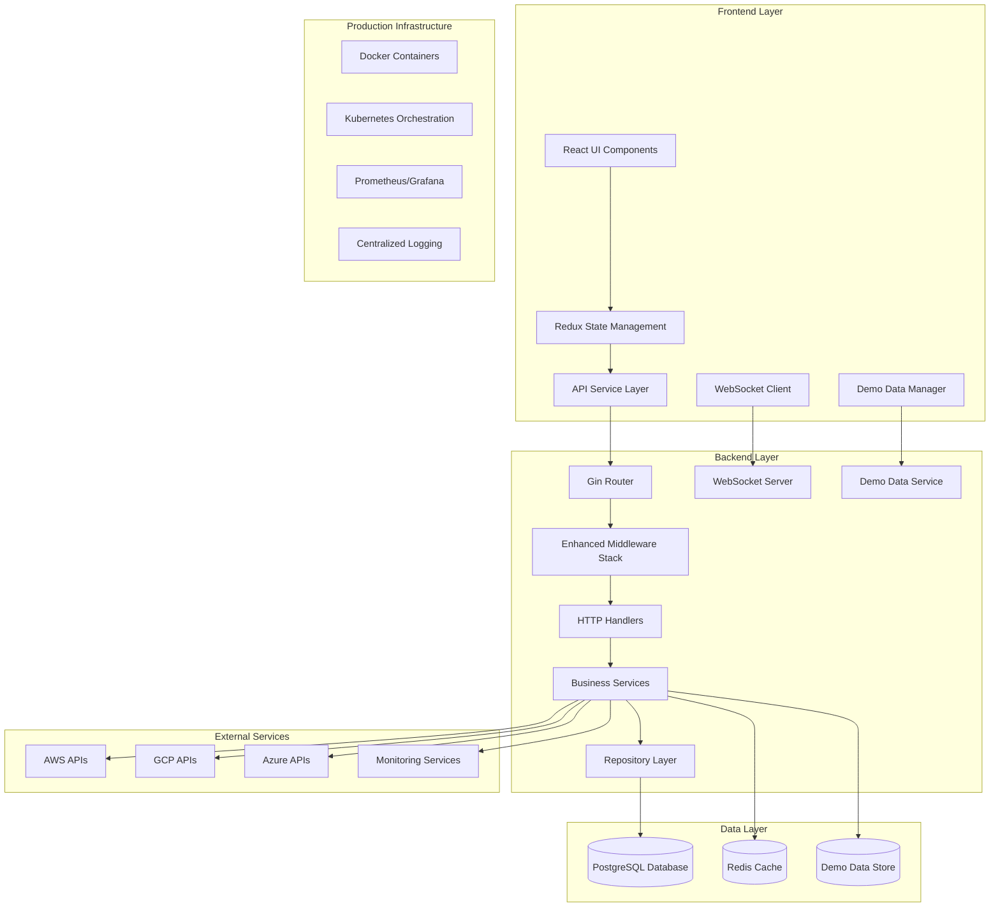

# Production-Ready Functionality Design Document

## Overview

This design document outlines the comprehensive approach to making the CloudWeave cloud platform management system production-ready. The application has a solid foundation with extensive backend APIs, frontend components, and database schema already implemented. This design focuses on completing the integration, ensuring all functionality works properly, implementing proper error handling, adding comprehensive testing, and optimizing for production deployment.

The design builds upon the existing architecture while addressing gaps in functionality, user experience, data management, and production readiness. The goal is to transform the current well-structured codebase into a fully functional, reliable, and scalable cloud management platform.

## Architecture

### Current Architecture Assessment

**Existing Strengths:**
- Comprehensive Go backend with Gin framework and repository pattern
- Complete PostgreSQL database schema with all necessary tables
- Modern React frontend with TypeScript, Redux Toolkit, and glassmorphism UI
- JWT authentication with refresh token support
- WebSocket server for real-time updates
- Extensive API endpoints for all major features
- Cloud provider service abstractions (AWS, Azure, GCP)
- Security scanning and compliance management systems
- RBAC implementation with role and permission management

**Architecture Enhancements Needed:**



### Enhanced Middleware Stack

**Production-Ready Middleware:**
```go
// Enhanced middleware stack for production
func SetupMiddleware(router *gin.Engine, cfg *config.Config) {
    // Security middleware
    router.Use(middleware.SecurityHeaders())
    router.Use(middleware.RateLimiting(cfg.RateLimit))
    router.Use(middleware.RequestSizeLimit(cfg.MaxRequestSize))
    
    // Observability middleware
    router.Use(middleware.RequestID())
    router.Use(middleware.StructuredLogger())
    router.Use(middleware.Metrics())
    router.Use(middleware.Tracing())
    
    // Error handling and recovery
    router.Use(middleware.ErrorHandler())
    router.Use(middleware.Recovery())
    
    // CORS with production settings
    router.Use(middleware.CORS(cfg.CORS))
    
    // Health checks
    router.Use(middleware.HealthCheck())
}
```

## Components and Interfaces

### Demo Data Management System

**Demo Data Service:**
```go
type DemoDataService struct {
    userRepo         UserRepository
    infraRepo        InfrastructureRepository
    deploymentRepo   DeploymentRepository
    metricsRepo      MetricsRepository
    alertRepo        AlertRepository
    demoDataStore    DemoDataStore
}

type DemoDataStore interface {
    GetDemoInfrastructure(userID string) ([]*models.Infrastructure, error)
    GetDemoDeployments(userID string) ([]*models.Deployment, error)
    GetDemoMetrics(userID string, timeRange TimeRange) ([]*models.Metric, error)
    GetDemoAlerts(userID string) ([]*models.Alert, error)
    GenerateRealisticData(userID string, scenario DemoScenario) error
    ClearDemoData(userID string) error
}

// Demo data scenarios for different use cases
type DemoScenario string

const (
    DemoScenarioStartup     DemoScenario = "startup"
    DemoScenarioEnterprise  DemoScenario = "enterprise"
    DemoScenarioDevOps      DemoScenario = "devops"
    DemoScenarioMultiCloud  DemoScenario = "multicloud"
)

func (s *DemoDataService) InitializeDemoData(userID string, scenario DemoScenario) error {
    // Generate realistic demo data based on scenario
    switch scenario {
    case DemoScenarioStartup:
        return s.generateStartupScenario(userID)
    case DemoScenarioEnterprise:
        return s.generateEnterpriseScenario(userID)
    case DemoScenarioDevOps:
        return s.generateDevOpsScenario(userID)
    case DemoScenarioMultiCloud:
        return s.generateMultiCloudScenario(userID)
    default:
        return s.generateDefaultScenario(userID)
    }
}
```

### Cloud Provider Integration Enhancement

**Enhanced Cloud Provider Interface:**
```go
type CloudProvider interface {
    // Connection and authentication
    TestConnection(ctx context.Context, credentials CloudCredentials) error
    ValidateCredentials(ctx context.Context, credentials CloudCredentials) (*ValidationResult, error)
    
    // Resource management
    GetResources(ctx context.Context, config ProviderConfig) ([]*Resource, error)
    CreateResource(ctx context.Context, config ProviderConfig, spec ResourceSpec) (*Resource, error)
    UpdateResource(ctx context.Context, config ProviderConfig, id string, spec ResourceSpec) error
    DeleteResource(ctx context.Context, config ProviderConfig, id string) error
    
    // Monitoring and metrics
    GetMetrics(ctx context.Context, config ProviderConfig, resourceID string, timeRange TimeRange) ([]*Metric, error)
    GetCostData(ctx context.Context, config ProviderConfig, timeRange TimeRange) (*CostData, error)
    
    // Real-time updates
    SubscribeToUpdates(ctx context.Context, config ProviderConfig, callback UpdateCallback) error
    UnsubscribeFromUpdates(ctx context.Context, subscriptionID string) error
}

type ValidationResult struct {
    Valid       bool                   `json:"valid"`
    Permissions []string               `json:"permissions"`
    Limitations []string               `json:"limitations"`
    Regions     []string               `json:"regions"`
    Services    []string               `json:"services"`
    Errors      []ValidationError      `json:"errors,omitempty"`
}

type CloudCredentials struct {
    Provider    string                 `json:"provider"`
    Type        string                 `json:"type"` // access_key, service_account, etc.
    Credentials map[string]interface{} `json:"credentials"`
    Region      string                 `json:"region,omitempty"`
    ProjectID   string                 `json:"project_id,omitempty"`
}
```

### Enhanced Frontend State Management

**Production-Ready Redux Store:**
```typescript
// Enhanced store structure with proper typing
interface RootState {
  auth: AuthState;
  ui: UIState;
  infrastructure: InfrastructureState;
  deployments: DeploymentState;
  monitoring: MonitoringState;
  security: SecurityState;
  costManagement: CostManagementState;
  settings: SettingsState;
  demo: DemoState;
  cloudProviders: CloudProviderState;
  notifications: NotificationState;
}

interface DemoState {
  isDemo: boolean;
  scenario: DemoScenario;
  demoDataLoaded: boolean;
  demoIndicatorsVisible: boolean;
}

interface CloudProviderState {
  providers: CloudProvider[];
  activeProvider: CloudProvider | null;
  connectionStatus: Record<string, ConnectionStatus>;
  credentials: Record<string, CloudCredentials>;
  validationResults: Record<string, ValidationResult>;
  loading: boolean;
  error: string | null;
}

// Enhanced API service with demo data handling
class EnhancedApiService extends ApiService {
  private demoDataService: DemoDataService;
  
  async get<T>(url: string, config?: any): Promise<T> {
    try {
      // Try real API first
      return await super.get<T>(url, config);
    } catch (error) {
      // Fallback to demo data if user is in demo mode
      if (this.isDemoMode()) {
        return await this.demoDataService.getDemoData<T>(url);
      }
      throw error;
    }
  }
  
  private isDemoMode(): boolean {
    const state = store.getState();
    return state.demo.isDemo || !state.cloudProviders.providers.length;
  }
}
```

### User Onboarding Flow

**Onboarding Component Architecture:**
```typescript
interface OnboardingFlow {
  steps: OnboardingStep[];
  currentStep: number;
  completed: boolean;
  skipped: boolean;
}

interface OnboardingStep {
  id: string;
  title: string;
  description: string;
  component: React.ComponentType<OnboardingStepProps>;
  required: boolean;
  completed: boolean;
}

const OnboardingSteps: OnboardingStep[] = [
  {
    id: 'welcome',
    title: 'Welcome to CloudWeave',
    description: 'Get started with your cloud management platform',
    component: WelcomeStep,
    required: true,
    completed: false,
  },
  {
    id: 'cloud-providers',
    title: 'Connect Cloud Providers',
    description: 'Add your AWS, Azure, or GCP accounts',
    component: CloudProviderSetupStep,
    required: false,
    completed: false,
  },
  {
    id: 'demo-or-real',
    title: 'Choose Your Experience',
    description: 'Explore with demo data or use your real infrastructure',
    component: DemoOrRealStep,
    required: true,
    completed: false,
  },
  {
    id: 'preferences',
    title: 'Set Your Preferences',
    description: 'Customize your dashboard and notifications',
    component: PreferencesStep,
    required: false,
    completed: false,
  },
];

const OnboardingWizard: React.FC = () => {
  const [flow, setFlow] = useState<OnboardingFlow>({
    steps: OnboardingSteps,
    currentStep: 0,
    completed: false,
    skipped: false,
  });
  
  const handleStepComplete = (stepId: string) => {
    // Update step completion and advance to next step
    setFlow(prev => ({
      ...prev,
      steps: prev.steps.map(step => 
        step.id === stepId ? { ...step, completed: true } : step
      ),
      currentStep: prev.currentStep + 1,
    }));
  };
  
  const handleSkipOnboarding = () => {
    // Set user to demo mode and complete onboarding
    dispatch(setDemoMode(true));
    dispatch(initializeDemoData('startup'));
    setFlow(prev => ({ ...prev, skipped: true, completed: true }));
  };
  
  return (
    <OnboardingContainer>
      {/* Onboarding wizard implementation */}
    </OnboardingContainer>
  );
};
```

## Data Models

### Enhanced User and Organization Models

**Production-Ready User Model:**
```go
type User struct {
    ID             string                 `json:"id" db:"id"`
    Email          string                 `json:"email" db:"email"`
    Name           string                 `json:"name" db:"name"`
    PasswordHash   string                 `json:"-" db:"password_hash"`
    Role           string                 `json:"role" db:"role"`
    OrganizationID string                 `json:"organizationId" db:"organization_id"`
    Preferences    UserPreferences        `json:"preferences" db:"preferences"`
    AvatarURL      *string                `json:"avatarUrl" db:"avatar_url"`
    EmailVerified  bool                   `json:"emailVerified" db:"email_verified"`
    OnboardingCompleted bool              `json:"onboardingCompleted" db:"onboarding_completed"`
    DemoMode       bool                   `json:"demoMode" db:"demo_mode"`
    DemoScenario   string                 `json:"demoScenario" db:"demo_scenario"`
    LastLoginAt    *time.Time             `json:"lastLoginAt" db:"last_login_at"`
    CreatedAt      time.Time              `json:"createdAt" db:"created_at"`
    UpdatedAt      time.Time              `json:"updatedAt" db:"updated_at"`
}

type UserPreferences struct {
    Theme                string            `json:"theme"`
    Language             string            `json:"language"`
    Timezone             string            `json:"timezone"`
    NotificationSettings NotificationPrefs `json:"notifications"`
    DashboardLayout      DashboardLayout   `json:"dashboardLayout"`
    DefaultCloudProvider string            `json:"defaultCloudProvider"`
}

type NotificationPrefs struct {
    Email     bool `json:"email"`
    InApp     bool `json:"inApp"`
    Slack     bool `json:"slack"`
    Webhook   bool `json:"webhook"`
    Alerts    bool `json:"alerts"`
    Deployments bool `json:"deployments"`
    CostAlerts  bool `json:"costAlerts"`
}
```

### Cloud Provider Configuration Models

**Enhanced Cloud Provider Models:**
```go
type CloudProviderConfig struct {
    ID           string                 `json:"id" db:"id"`
    UserID       string                 `json:"userId" db:"user_id"`
    OrganizationID string               `json:"organizationId" db:"organization_id"`
    Provider     string                 `json:"provider" db:"provider"`
    Name         string                 `json:"name" db:"name"`
    Credentials  EncryptedCredentials   `json:"-" db:"credentials"`
    Status       ConnectionStatus       `json:"status" db:"status"`
    LastSync     *time.Time             `json:"lastSync" db:"last_sync"`
    SyncInterval time.Duration          `json:"syncInterval" db:"sync_interval"`
    Regions      []string               `json:"regions" db:"regions"`
    Services     []string               `json:"services" db:"services"`
    Tags         map[string]string      `json:"tags" db:"tags"`
    CreatedAt    time.Time              `json:"createdAt" db:"created_at"`
    UpdatedAt    time.Time              `json:"updatedAt" db:"updated_at"`
}

type ConnectionStatus string

const (
    ConnectionStatusPending     ConnectionStatus = "pending"
    ConnectionStatusConnected   ConnectionStatus = "connected"
    ConnectionStatusError       ConnectionStatus = "error"
    ConnectionStatusDisconnected ConnectionStatus = "disconnected"
)

type EncryptedCredentials struct {
    Data      []byte `json:"-" db:"data"`
    KeyID     string `json:"-" db:"key_id"`
    Algorithm string `json:"-" db:"algorithm"`
}
```

### Demo Data Models

**Demo Data Structure:**
```go
type DemoDataSet struct {
    UserID        string                    `json:"userId"`
    Scenario      DemoScenario              `json:"scenario"`
    Infrastructure []*DemoInfrastructure    `json:"infrastructure"`
    Deployments   []*DemoDeployment         `json:"deployments"`
    Metrics       []*DemoMetric             `json:"metrics"`
    Alerts        []*DemoAlert              `json:"alerts"`
    CostData      *DemoCostData             `json:"costData"`
    GeneratedAt   time.Time                 `json:"generatedAt"`
    ExpiresAt     *time.Time                `json:"expiresAt"`
}

type DemoInfrastructure struct {
    *models.Infrastructure
    DemoMetadata DemoMetadata `json:"demoMetadata"`
}

type DemoMetadata struct {
    IsDemo      bool              `json:"isDemo"`
    Scenario    DemoScenario      `json:"scenario"`
    Realistic   bool              `json:"realistic"`
    Tags        []string          `json:"tags"`
    Description string            `json:"description"`
}
```

## Error Handling

### Comprehensive Error Management System

**Production Error Handling:**
```go
// Enhanced error types for production
type AppError struct {
    Code       string                 `json:"code"`
    Message    string                 `json:"message"`
    Details    map[string]interface{} `json:"details,omitempty"`
    StatusCode int                    `json:"-"`
    Timestamp  time.Time              `json:"timestamp"`
    RequestID  string                 `json:"requestId,omitempty"`
    UserID     string                 `json:"-"` // For logging, not exposed
    Stack      string                 `json:"-"` // For logging, not exposed
}

// Error categories for better handling
const (
    ErrorCategoryValidation    = "VALIDATION"
    ErrorCategoryAuthentication = "AUTHENTICATION"
    ErrorCategoryAuthorization = "AUTHORIZATION"
    ErrorCategoryDatabase      = "DATABASE"
    ErrorCategoryExternal      = "EXTERNAL_SERVICE"
    ErrorCategoryInternal      = "INTERNAL"
    ErrorCategoryRateLimit     = "RATE_LIMIT"
    ErrorCategoryNotFound      = "NOT_FOUND"
)

// Error handling middleware with comprehensive logging
func ErrorHandlerMiddleware(logger *logrus.Logger) gin.HandlerFunc {
    return func(c *gin.Context) {
        c.Next()
        
        if len(c.Errors) > 0 {
            err := c.Errors.Last()
            requestID := c.GetString("requestID")
            userID := c.GetString("userID")
            
            var appErr *AppError
            if errors.As(err.Err, &appErr) {
                appErr.RequestID = requestID
                
                // Log error with context
                logger.WithFields(logrus.Fields{
                    "error_code":   appErr.Code,
                    "request_id":   requestID,
                    "user_id":      userID,
                    "method":       c.Request.Method,
                    "path":         c.Request.URL.Path,
                    "status_code":  appErr.StatusCode,
                    "stack_trace":  appErr.Stack,
                }).Error(appErr.Message)
                
                c.JSON(appErr.StatusCode, models.ApiResponse{
                    Success:   false,
                    Error:     appErr,
                    RequestID: requestID,
                    Timestamp: time.Now(),
                })
                return
            }
            
            // Handle unknown errors
            unknownErr := &AppError{
                Code:       "INTERNAL_ERROR",
                Message:    "An internal error occurred",
                StatusCode: http.StatusInternalServerError,
                Timestamp:  time.Now(),
                RequestID:  requestID,
            }
            
            logger.WithFields(logrus.Fields{
                "request_id": requestID,
                "user_id":    userID,
                "method":     c.Request.Method,
                "path":       c.Request.URL.Path,
                "error":      err.Err.Error(),
            }).Error("Unhandled error occurred")
            
            c.JSON(http.StatusInternalServerError, models.ApiResponse{
                Success:   false,
                Error:     unknownErr,
                RequestID: requestID,
                Timestamp: time.Now(),
            })
        }
    }
}
```

**Frontend Error Handling:**
```typescript
// Enhanced error handling in React
interface ErrorState {
  hasError: boolean;
  error: Error | null;
  errorInfo: ErrorInfo | null;
  errorId: string;
}

class ProductionErrorBoundary extends React.Component<Props, ErrorState> {
  constructor(props: Props) {
    super(props);
    this.state = { 
      hasError: false, 
      error: null, 
      errorInfo: null,
      errorId: '',
    };
  }
  
  static getDerivedStateFromError(error: Error): Partial<ErrorState> {
    return { 
      hasError: true, 
      error,
      errorId: generateErrorId(),
    };
  }
  
  componentDidCatch(error: Error, errorInfo: ErrorInfo) {
    const errorId = this.state.errorId;
    
    // Log to console in development
    if (process.env.NODE_ENV === 'development') {
      console.error('Error caught by boundary:', error, errorInfo);
    }
    
    // Send to error reporting service
    errorReportingService.captureException(error, {
      errorInfo,
      errorId,
      userId: this.props.userId,
      timestamp: new Date().toISOString(),
      userAgent: navigator.userAgent,
      url: window.location.href,
    });
    
    // Update state with error info
    this.setState({ errorInfo });
  }
  
  render() {
    if (this.state.hasError) {
      return (
        <ErrorFallback 
          error={this.state.error}
          errorInfo={this.state.errorInfo}
          errorId={this.state.errorId}
          onRetry={() => this.setState({ hasError: false, error: null, errorInfo: null })}
          onReport={() => this.reportError()}
        />
      );
    }
    
    return this.props.children;
  }
}

// Global error handler for unhandled promise rejections
window.addEventListener('unhandledrejection', (event) => {
  console.error('Unhandled promise rejection:', event.reason);
  errorReportingService.captureException(event.reason, {
    type: 'unhandledrejection',
    timestamp: new Date().toISOString(),
  });
});
```

## Testing Strategy

### Comprehensive Testing Implementation

**Backend Testing Architecture:**
```go
// Test suite structure
type TestSuite struct {
    DB          *sql.DB
    TestDB      *testcontainers.Container
    Router      *gin.Engine
    Services    *ServiceContainer
    Repositories *RepositoryManager
}

func (ts *TestSuite) SetupSuite() {
    // Setup test database container
    ts.TestDB = setupTestDatabase()
    ts.DB = connectToTestDB(ts.TestDB)
    
    // Run migrations
    runTestMigrations(ts.DB)
    
    // Setup test services
    ts.Repositories = repositories.NewRepositoryManager(ts.DB)
    ts.Services = setupTestServices(ts.Repositories)
    ts.Router = setupTestRouter(ts.Services)
}

func (ts *TestSuite) TearDownSuite() {
    ts.DB.Close()
    ts.TestDB.Terminate(context.Background())
}

// Integration test example
func (ts *TestSuite) TestInfrastructureWorkflow() {
    // Test complete infrastructure management workflow
    
    // 1. Create user and authenticate
    user := ts.createTestUser()
    token := ts.authenticateUser(user)
    
    // 2. Add cloud provider
    provider := ts.addCloudProvider(user.ID, token)
    
    // 3. Create infrastructure
    infra := ts.createInfrastructure(user.ID, provider.ID, token)
    
    // 4. Verify infrastructure was created
    retrieved := ts.getInfrastructure(infra.ID, token)
    assert.Equal(ts.T(), infra.Name, retrieved.Name)
    
    // 5. Update infrastructure
    updated := ts.updateInfrastructure(infra.ID, token)
    assert.NotEqual(ts.T(), infra.UpdatedAt, updated.UpdatedAt)
    
    // 6. Delete infrastructure
    ts.deleteInfrastructure(infra.ID, token)
    
    // 7. Verify infrastructure was deleted
    _, err := ts.getInfrastructure(infra.ID, token)
    assert.Error(ts.T(), err)
}
```

**Frontend Testing Strategy:**
```typescript
// Component testing with comprehensive coverage
describe('InfrastructurePage Integration', () => {
  let mockStore: MockStore;
  let mockApiService: jest.Mocked<ApiService>;
  
  beforeEach(() => {
    mockApiService = createMockApiService();
    mockStore = createMockStore({
      auth: { isAuthenticated: true, user: mockUser },
      infrastructure: { resources: [], loading: false, error: null },
      cloudProviders: { providers: [mockAWSProvider], activeProvider: mockAWSProvider },
      demo: { isDemo: false, scenario: 'enterprise' },
    });
  });
  
  it('should handle complete infrastructure management workflow', async () => {
    const user = userEvent.setup();
    
    // Mock API responses
    mockApiService.get.mockResolvedValueOnce(mockInfrastructureList);
    mockApiService.post.mockResolvedValueOnce(mockNewInfrastructure);
    
    render(
      <Provider store={mockStore}>
        <MemoryRouter>
          <InfrastructurePage />
        </MemoryRouter>
      </Provider>
    );
    
    // Wait for initial load
    await waitFor(() => {
      expect(screen.getByText('Infrastructure Management')).toBeInTheDocument();
    });
    
    // Test create infrastructure flow
    const createButton = screen.getByRole('button', { name: /create resource/i });
    await user.click(createButton);
    
    // Fill out form
    await user.type(screen.getByLabelText(/resource name/i), 'test-server');
    await user.selectOptions(screen.getByLabelText(/resource type/i), 'server');
    await user.selectOptions(screen.getByLabelText(/provider/i), 'aws');
    
    // Submit form
    const submitButton = screen.getByRole('button', { name: /create/i });
    await user.click(submitButton);
    
    // Verify API was called
    expect(mockApiService.post).toHaveBeenCalledWith('/infrastructure', {
      name: 'test-server',
      type: 'server',
      provider: 'aws',
    });
    
    // Verify success message
    await waitFor(() => {
      expect(screen.getByText(/resource created successfully/i)).toBeInTheDocument();
    });
  });
  
  it('should handle demo mode correctly', async () => {
    // Set demo mode
    mockStore = createMockStore({
      ...mockStore.getState(),
      demo: { isDemo: true, scenario: 'startup' },
      cloudProviders: { providers: [], activeProvider: null },
    });
    
    render(
      <Provider store={mockStore}>
        <MemoryRouter>
          <InfrastructurePage />
        </MemoryRouter>
      </Provider>
    );
    
    // Verify demo indicators are shown
    expect(screen.getByText(/demo data/i)).toBeInTheDocument();
    expect(screen.getByText(/sample infrastructure/i)).toBeInTheDocument();
    
    // Verify demo data is displayed
    expect(screen.getByText('demo-web-server-1')).toBeInTheDocument();
    expect(screen.getByText('demo-database-1')).toBeInTheDocument();
  });
});

// E2E testing with Playwright
test('complete user onboarding and infrastructure management', async ({ page }) => {
  // Test complete user journey from registration to infrastructure management
  
  // 1. Register new user
  await page.goto('/register');
  await page.fill('[data-testid="email"]', 'newuser@example.com');
  await page.fill('[data-testid="name"]', 'New User');
  await page.fill('[data-testid="password"]', 'SecurePassword123!');
  await page.click('[data-testid="register-button"]');
  
  // 2. Complete onboarding
  await expect(page).toHaveURL('/onboarding');
  
  // Skip cloud provider setup for demo
  await page.click('[data-testid="skip-cloud-setup"]');
  await page.click('[data-testid="use-demo-data"]');
  await page.click('[data-testid="complete-onboarding"]');
  
  // 3. Verify dashboard loads with demo data
  await expect(page).toHaveURL('/dashboard');
  await expect(page.locator('[data-testid="demo-indicator"]')).toBeVisible();
  
  // 4. Navigate to infrastructure
  await page.click('[data-testid="infrastructure-nav"]');
  await expect(page).toHaveURL('/infrastructure');
  
  // 5. Verify demo infrastructure is displayed
  await expect(page.locator('[data-testid="demo-infrastructure-list"]')).toBeVisible();
  await expect(page.locator('text=demo-web-server-1')).toBeVisible();
  
  // 6. Test infrastructure creation in demo mode
  await page.click('[data-testid="create-resource-button"]');
  await page.fill('[data-testid="resource-name"]', 'test-demo-server');
  await page.selectOption('[data-testid="resource-type"]', 'server');
  await page.click('[data-testid="create-button"]');
  
  // 7. Verify demo creation success
  await expect(page.locator('text=Demo resource created')).toBeVisible();
  await expect(page.locator('text=test-demo-server')).toBeVisible();
});
```

This design provides a comprehensive approach to making CloudWeave production-ready by addressing all the key requirements: proper API integration, demo data management, user onboarding, error handling, testing, and production optimization. The architecture builds upon the existing solid foundation while adding the necessary components for a fully functional, reliable, and scalable cloud management platform.